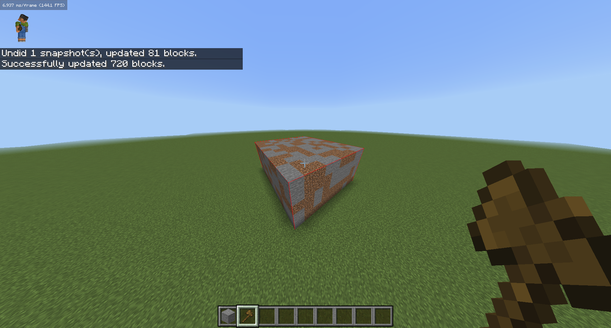

# WorldEdit

A Java reimplementation of the classic WorldEdit plugin for Allay.

Implements general, navigation, region, and clipboard commands. Documentation is available at https://worldedit.enginehub.org/en/latest/commands/.

Commands use a single slash instead of two to preserve bedrock client auto-completion capabilities. Debug boxes are used for selections and can be disabled via `/selboxtoggle`.

## Screenshots

## Install
- Download the .jar file from the releases page
- Place it in the ./plugins folder
- Restart the server
- Enjoy!

